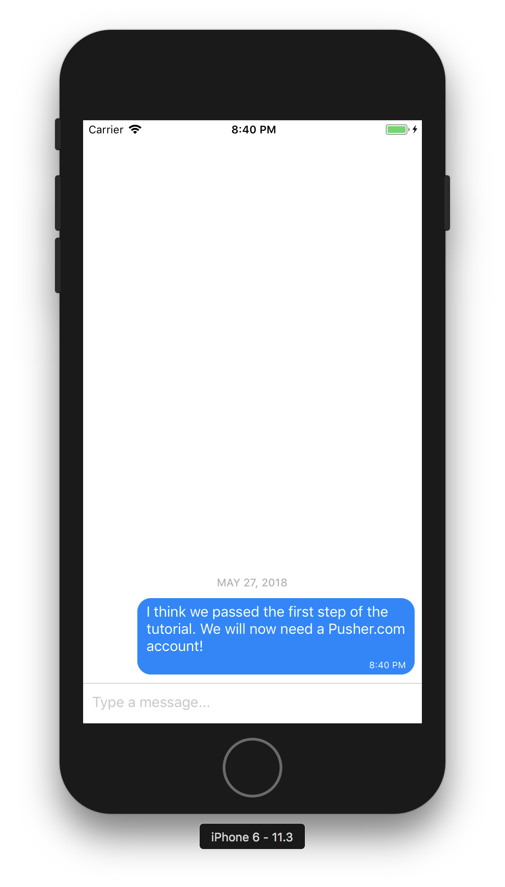
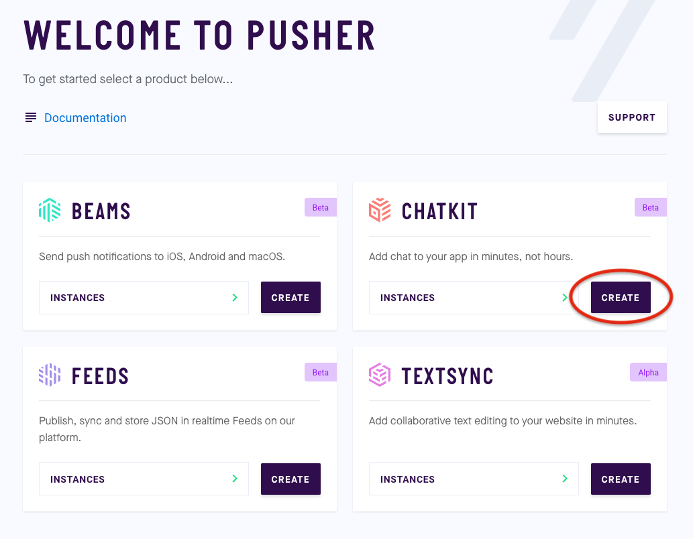
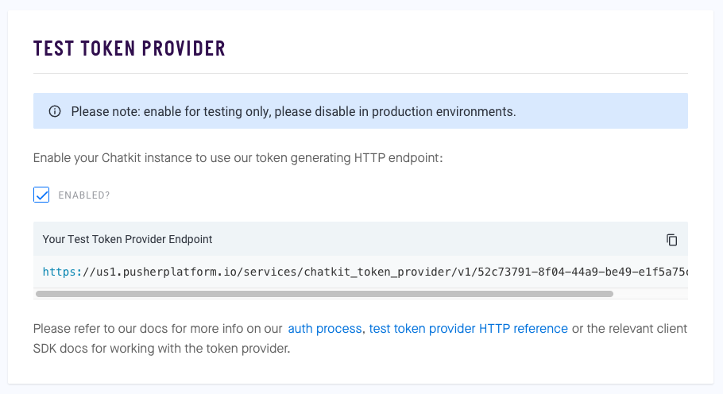
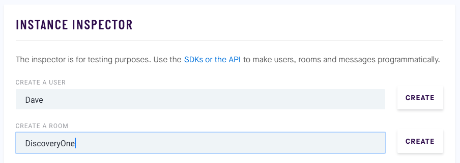
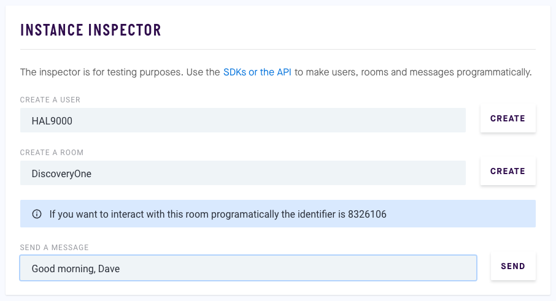

# Gifted Chat with Chatkit

This tutorial will show you how to build your own real-time chat bot using [Pusher](http://pusher.com/) and [Gifted Chat](http://gifted.chat)

## Create New Project

Start out creating an empty React Native project.
Let's call it _GiftedChatWithPusher_

```bash
react-native init GiftedChatWithPusher
```

Once you have the project, go inside it with

```bash
cd GiftedChatWithPusher
```

## Install Modules

Now, you are going to need two modules for react-native:

1.  [@pusher/chatkit](https://www.npmjs.com/package/@pusher/chatkit)
2.  [react-native-gifted-chat](https://www.npmjs.com/package/react-native-gifted-chat)

In order install them in your project, write following commands:

```bash
npm install @pusher/chatkit react-native-gifted-chat --save
```

## Start with non-realtime chat

Let's try to implement basic chat.
Create a new file called and `MyChat.js` in root folder with following code:

```js
import React from "react";
import { GiftedChat } from "react-native-gifted-chat";

export default class MyChat extends React.Component {
  state = {
    messages: []
  };

  componentDidMount() {
    this.setState({
      messages: [
        {
          _id: 1,
          text: "I think we passed the first step of the tutorial. We will now need a Pusher account!",
          createdAt: new Date(),
          user: {
            _id: 1,
            name: "React Native",
            avatar: "https://placeimg.com/140/140/any"
          }
        }
      ]
    });
  }

  render() {
    return <GiftedChat messages={this.state.messages} />;
  }
}
```

And replace the existing code in `App.js` with

```js
import React, { Component } from "react";
import MyChat from "./MyChat";

export default class App extends Component {
  render() {
    return <MyChat />;
  }
}
```

Now try running your app to see a basic chat module with an initial chat message bubble.

`react-native run-ios` or `react-native run-android`



## Get Pusher Account

Now that you have set-up your project with modules, you need a Pusher account.

It's a very simple process. Simply go to [pusher.com/chatkit](https://pusher.com/chatkit) and sign up for the public beta. You can do so using your Google account, GitHub account or regular email and password.

Once you have signed up, you will be redirected to the dashboard.



Here, you need click on the _"CREATE"_ button below _Chatkit_. A dialogue box will appear asking you to give your instance a name (e.g. `MyFirstChat`). When you are done, click _CREATE_ and you have your first Chatkit instance ready.

You can find the instance on the left menu bar of the dashboard.
If you go into the dashboard of the app, you will find several tabs pertaining to the Chatkit instance. For this sake of this tutorial, we won't be needing all of them.

Start by exploring your keys section. You will find your _"Instance Locator"_ here, along with _"Secret Key"_.

You will be needing them when we back to coding.

Next, go to the _"TEST TOKEN PROVIDER"_ section. You will find the test token provider here. By default it is disabled. But for our testing we will need it, so enable it. You will see an endpoint for test token provider show up.



Next up, _"INSTANCE INSPECTOR"_.

This is the home of the trinity of Chatkit. The [user](https://docs.pusher.com/chatkit/reference/api#users). The [room](https://docs.pusher.com/chatkit/reference/api#rooms). The [message](https://docs.pusher.com/chatkit/reference/api#messages).

Basically, every user has to be in at least one room and every room needs to have at least one user. If you satisfy this, you will be able to send and receive messages for the user-room pair. So, let's try doing that.

For the purpose of this example we will use the following room-user pair.
Let's call the user: `Dave`
and the room: `DiscoveryOne`



## Implement Pusher API

Back to code now!

In your `MyChat.js` component (that we just created), import the Chatkit module

```js
import Chatkit from "@pusher/chatkit";
```

Add the needed constants above the class declaration

```js
const CHATKIT_TOKEN_PROVIDER_ENDPOINT = "<url from TEST TOKEN PROVIDER section>";
const CHATKIT_INSTANCE_LOCATOR = "<id from CREDENTIALS section>";
const CHATKIT_ROOM_ID = "<room identifier from INSTANCE INSPECTOR section>";
const CHATKIT_USER_NAME = "<user name>"; // Let's chat as "Dave" for this tutorial
```

And replace the current `componentDidMount` function

```js
componentDidMount() {
  // This will create a `tokenProvider` object. This object will be later used to make a Chatkit Manager instance.
  const tokenProvider = new Chatkit.TokenProvider({
    url: CHATKIT_TOKEN_PROVIDER_ENDPOINT
  });

  // This will instantiate a `chatManager` object. This object can be used to subscribe to any number of rooms and users and corresponding messages.
  // For the purpose of this example we will use single room-user pair.
  const chatManager = new Chatkit.ChatManager({
    instanceLocator: CHATKIT_INSTANCE_LOCATOR,
    userId: CHATKIT_USER_NAME,
    tokenProvider: tokenProvider
  });

  // In order to subscribe to the messages this user is receiving in this room, we need to `connect()` the `chatManager` and have a hook on `onNewMessage`. There are several other hooks that you can use for various scenarios. A comprehensive list can be found [here](https://docs.pusher.com/chatkit/reference/javascript#connection-hooks).
  chatManager.connect().then(currentUser => {
    this.currentUser = currentUser;
    this.currentUser.subscribeToRoom({
      roomId: CHATKIT_ROOM_ID,
      hooks: {
        onNewMessage: message => alert(message.text)
      }
    });
  });
}
```

Here we have hooked a room subscriber to be trigger dynamically at an event of incoming message. It will fire an event that _alerts_ the data coming from pusher's trigger.

## Send message to test

Wanna test it? There are several ways to send a message to a user in any given room. You can create a back-end server in any of the wide range of frameworks supported by Pusher Chatkit and use the `sendMessage` function. OR you can send it from a the _INSTANCE INSPECTOR_ section of the dashboard itself.

So let's go back there and open the _INSTANCE INSPECTOR_ section. There you will find fields to input the name of user, room and a text message.

Create a new user called `HAL9000` for the room `DiscoveryOne` and send the message `Good morning, Dave`.



At this point, you should find an _alert_ on your emulator showing the data that you just sent.

## Make it real!

But we want this message to be integrated with our _Gifted Chat_ module, right? We want any incoming message to show as a [message](https://github.com/FaridSafi/react-native-gifted-chat#message-object) in out chat window. Let's see how we can pull that off.

We can create a method, say `onReceive` and make it handle the incoming data such that whenever there is a new message from the room `DiscoveryOne` and user `HAL9000` it would append it to the existing chat window.

```js
onReceive(data) {
  const { id, senderId, text, createdAt } = data;
  const incomingMessage = {
    _id: id,
    text: text,
    createdAt: new Date(createdAt),
    user: {
      _id: senderId,
      name: senderId,
      avatar: "https://encrypted-tbn0.gstatic.com/images?q=tbn:ANd9GcQmXGGuS_PrRhQt73sGzdZvnkQrPXvtA-9cjcPxJLhLo8rW-sVA"
    }
  };

  this.setState(previousState => ({
    messages: GiftedChat.append(previousState.messages, incomingMessage)
  }));
}
```

This `onReceive` method looks good but we need to bind it with our existing event subscriber. So instead of alerting the data, let's pass the data to this function.

We can do so by simply replacing `alert` and writing `onReceive` instead.

```diff
- onNewMessage: message => alert(message.text)
+ onNewMessage: this.onReceive.bind(this)
```

The final step will be to send messages directly from the chat window. 
Let's now add the Pusher `sendMessage` feature :

```js
onSend([message]) {
  this.currentUser.sendMessage({
    text: message.text,
    roomId: CHATKIT_ROOM_ID
  });
}
```

Connect the new `onSend` function with `Gifted Chat`

```diff
render() {
  return (
    <GiftedChat
      messages={this.state.messages}
+     onSend={messages => this.onSend(messages)}
+     user={{
+       _id: CHATKIT_USER_NAME
+     }}
    />
  );
}
```

And Voila! You have your own real-time chat bot built with react-native using Gifted Chat and Pusher Chatkit.

## Further Readings

The Pusher ecosystem is Chatkit is offers several real-time solutions. You can find more documentation details [here](https://docs.pusher.com/chatkit).

Chatkit is also supported on other frameworks for client-side:

* [JavaScript](https://docs.pusher.com/chatkit/reference/javascript)
* [Swift](https://docs.pusher.com/chatkit/reference/swift)
* [Android](https://docs.pusher.com/chatkit/reference/android)

And on the server-side:

* [Node.js](https://docs.pusher.com/chatkit/reference/server-node)
* [Go](https://docs.pusher.com/chatkit/reference/server-go)
* [Ruby](https://docs.pusher.com/chatkit/reference/server-ruby)
