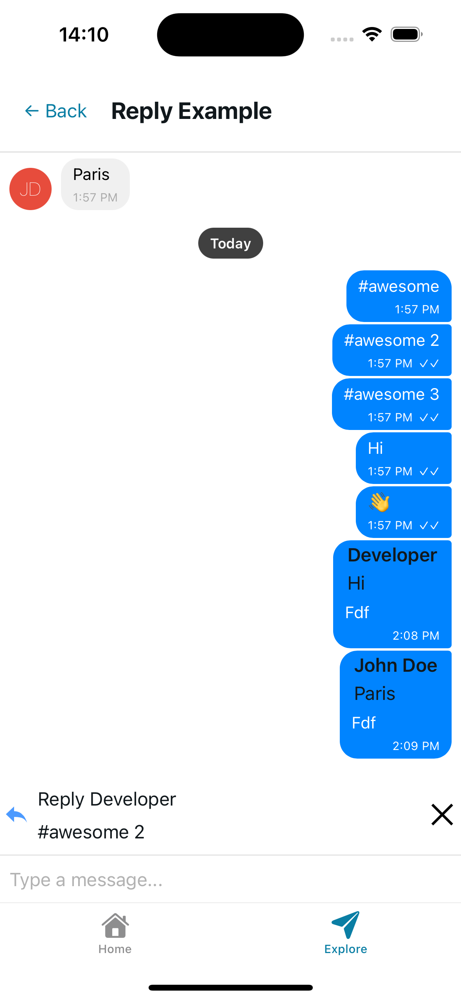
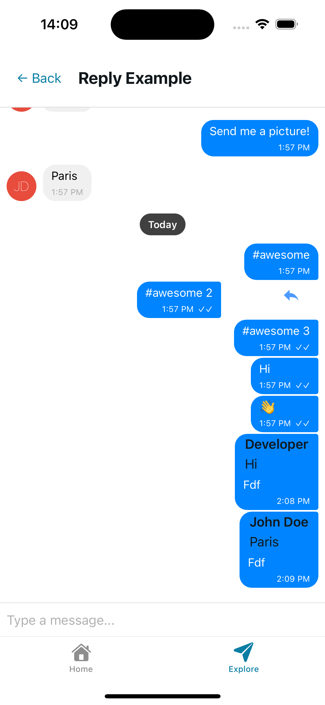

# Basic Reply Feature Implementation in Gifted Chat

Right now, Gifted Chat doesn’t provide a built-in way to implement reply functionality.  
To work around this, we can use `renderImage` to display the reply preview.  
You can also use `renderCustomView` or any other render prop.

> **Important:**  
> If you use renderers like `renderAudio`, `renderImage`, etc., make sure your message object includes the correct fields (e.g., `image: '1'`, `audio: '1'`) so the library knows which component should be rendered.

The UI in this example is fully customizable, so I didn’t spend time polishing the design.

---

### Preview

#### Reply Example  

#### Swipe to Reply Example  
